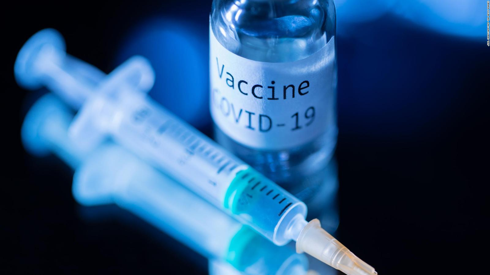

---
output:
  html_document: default
---
Impacto del proceso de vacunación contra el Covid-19
========================================================
author: Grupo 3
date: 3 de Agosto de 2021
autosize: true

Importancia
=========================================================
El estudio busca sensibilizar e informar a la población sobre los efectos generados por el proceso de vacunación contra la Covid-19 en las regiones del Perú, por lo que se considera un tema de interés público debido al contexto actual.

Obtención de los datos
========================================================
Plataforma Nacional de Datos Abiertos
- [Datos sobre vacunados](https://www.datosabiertos.gob.pe/dataset/vacunaci%C3%B3n-contra-covid-19-ministerio-de-salud-minsa-0): 
  - Observaciones completas:11 039 761
- [Datos sobre fallecidos](https://www.datosabiertos.gob.pe/dataset/fallecidos-por-covid-19-ministerio-de-salud-minsa/resource/4b7636f3-5f0c-4404-8526):
  - Observaciones completas: 194843
- Data tomada hasta el 14 de julio del 2021

========================================================

<h2 style="margin:200px 0 20px 0;font-size:400%;">Análisis descriptivo</h2>

DataSet: Fallecidos
========================================================

Personas fallecidas por edad

<figcaption>Se visualiza que las edades de las personas que más han fallecido por la pandemia tenían entre 60 y 75 años</figcaption>
<figcaption>A su vez, la mayor cantidad de fallecidos son personas mayor de 40 años</figcaption>
<figcaption>Esta gráfica, nos permite entender los rangos más afectados por covid-19</figcaption>

DataSet: Fallecidos
========================================================

Fallecidos por Covid-19 por día

<figcaption>Se puede observar claros picos en el aumento de fallecidos por día dados por la</figcaption>
<figcaption>primera y segunda ola de contagios en conjunto del sinceramiento de cifras realizado por el Gobierno.</figcaption>
<figcaption>Podemos observar, que el decremento rápido de los fallecimientos por día coincide con la llegada y el proceso de vacunación.</figcaption>

DataSet: Fallecidos
========================================================

Fallecidos de covid 19 por sexo

<figcaption>Se aprecia de forma simple y concisa que la cantidad de personas fallecidas por Covid - 19 han sido en su mayoría hombres</figcaption>
<figcaption>Esto es útil para estudiar posteriormente el impacto de la vacunación por sexo en los fallecimientos ya que podría haber distinción de este efecto según el sexo</figcaption>
<figcaption></figcaption>

DataSet: Fallecidos
========================================================

Fallecidos de covid 19 por departamentos

<figcaption>Como se observa en la gráfica, el departamento con mayor porcentaje de fallecidos en proporción a su población es Ica, a pesar de que Lima sea el departamento con un número de mayor de fallecidos. Con ello, podemos analizar el impacto del covid 19 por departamento en función de su poblacion con la finalidad de estudiar las estrategias sanitarias implementadas por el gobierno.</figcaption>

DataSet: Fallecidos
========================================================

<h3>Edad promedio de fallecidos por covid 19</h3>

Promedio de fallecidos: 66 años

Podemos observar que el sector más afectado por la pandemia son los adultos mayores o de tercera edad. Esta información es útil para nuestro estudio ya que podemos saber cuál fue el sector en el que se debió enfocar la atención y recursos médicos durante la emergencia.

<h3>Rango de edad de fallecidos por covid 19</h3>

Rango de edad: 117 años

El rango de edad de personas fallecidas a causa de Covid-19 nos indica todas las edades las cuales abarca nuestra muestra. Determinado por el máximo y mínimo de edad. Este dato nos sirve para confirmar que estamos tomando en cuenta todos los datos de fallecidos para cada una de nuestras gráficas en las que utilizamos este dato.

DataSet: Fallecidos
========================================================

<h3>Cantidad máxima y mínima de fallecidos por día</h3>

Mínima: 1 persona | Máxima: 846

La cantidad máxima y mínima de fallecidos por día nos indican los límites en los cuales se encuentra nuestra muestra. Esta información es útil para nuestro estudio ya que podemos evaluar si el momento actual de la pandemia puede ser considerado como estable o crítico.

<h3>Edad máxima y mínima de fallecidos</h3>

Mínima: 0 persona | Máxima: 117

Lo cual indica que hubo menores de edad fallecidos con menos de 1 año de edad. Podemos utilizar estos datos con la edad promedio de fallecidos por covid para determinar cuantos y cuales rangos de edad se han visto seriamente afectados por la Covid-19.

DataSet: Proceso de Vacunacion
========================================================

Fecha de vacunacion en funcion de la edad

<figcaption> A inicios de abril en donde terminó la vacunación de personal de primera línea y empezó la vacunación de personas mayores, iniciando con los rangos más altos de edad, para lo cual en mayo se puede observar el pico de promedio de edad más alto registrado</figcaption>

DataSet: Proceso de Vacunacion
========================================================

<figcaption>En la gráfica se observa, que el departamento de Tacna ha tenido un progreso mayor en proporción a comparación de Lima, donde se ha administrado el mayor número de dosis. Esto nos permite, analizar la planificación realizada por el gobierno para la distribución y proceso de vacunación contra la covid 19.</figcaption>

DataSet: Proceso de Vacunacion
========================================================

<figcaption>En este gráfico se observa que la cantidad de personas vacunadas del sexo femenino es superior a la del sexo masculino, siendo que las personas de sexo femenino han recibido alrededor de 6,000,000 de dosis y las de sexo masculino un número inferior pero entre las 5,500,000 y las 6,000,000 por lo que podríamos decir que la diferencia no es considerable</figcaption>

DataSet: Proceso de Vacunacion
========================================================

<figcaption>Se observa que el fabricante Pfizer, ha sido el principal proveedor de dosis, siendo que en el proceso se han utilizado alrededor de 8 millones de dosis es esta compañía. Muy por debajo, se encuentran los fabricantes Astrazeneca y Sinopharm, cuyas dosis han sido partícipes de alrededor de 2 millones y medio millón  de aplicaciones respectivamente. Aproximadamente el 36% de la población se encuentra vacunada con ambas dosis.</figcaption>

DataSet: Proceso de Vacunacion
========================================================

<figcaption>En el gráfico se observa que la cantidad de personas que han recibido una dosis supera a la que han recibido 2, lo que es totalmente normal considerando que existe una diferencia de días que se deben dar para poder aplicarse la segunda dosis. </figcaption>

========================================================

<h2 style="margin:250px 0 20px 0;font-size:400%;">Pruebas de hipótesis</h2>

Pruebas de hipótesis
========================================================

<h2>Primera hipótesis</h2>

Pruebas de hipótesis
========================================================

<h2>Segunda hipótesis</h2>

Pruebas de hipótesis
========================================================

<h2>Tercera hipótesis</h2>

========================================================

<h2 style="margin:225px 0 20px 0;font-size:300%;">Regresión</h2>

Regresión - Primera relación
========================================================

<h2>Cantidad de fallecidos en la 2da ola por etapa de vida x Cantidad de vacunados en la 2da ola para Adultos Mayores</h2>

<figcaption></figcation>

Regresión - Primera relación
========================================================

<h2>Cantidad de fallecidos en la 2da ola por etapa de vida x Cantidad de vacunados en la 2da ola para Adultos</h2>

<figcaption></figcation>

Regresión - Primera relación
========================================================

<h2>Cantidad de fallecidos en la 2da ola por etapa de vida x Cantidad de vacunados en la 2da ola para Jovenes</h2>

<figcaption></figcation>

Regresión - Segunda relación
========================================================

<h2>Cantidad de fallecidos por departamento en la 2da ola x Cantidad de vacunados por departamento en la 2da ola en el departamento con más vacunados</h2>

<figcaption></figcation>

Regresión - Segunda relacion
========================================================
<h2>Cantidad de fallecidos por departamento en la 2da ola x Cantidad de vacunados por departamento en la 2da ola en el departamento con menos vacunados</h2>

<h2></h2>

<figcaption></figcation>

========================================================

<h2 style="margin:250px 0 20px 0;font-size:400%;">Gracias</h2>

¿Preguntas?

