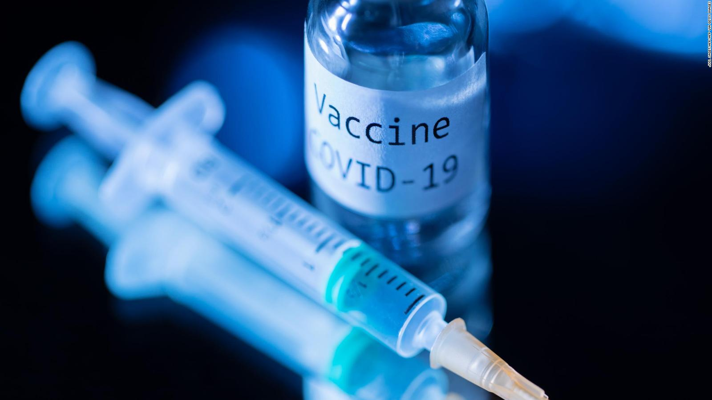
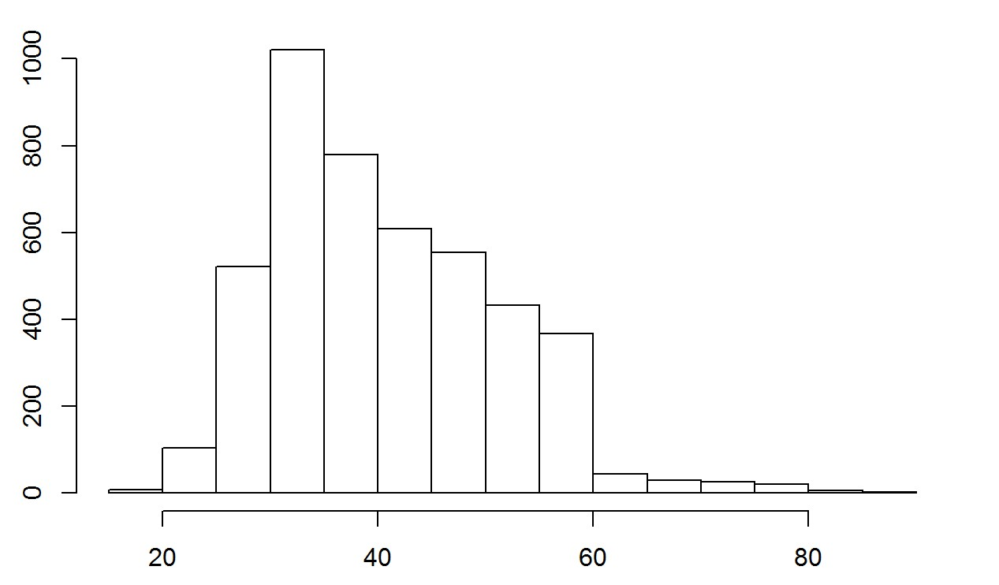
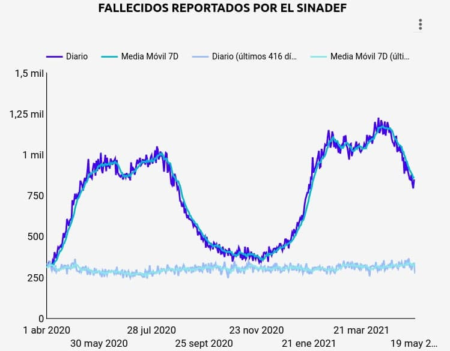
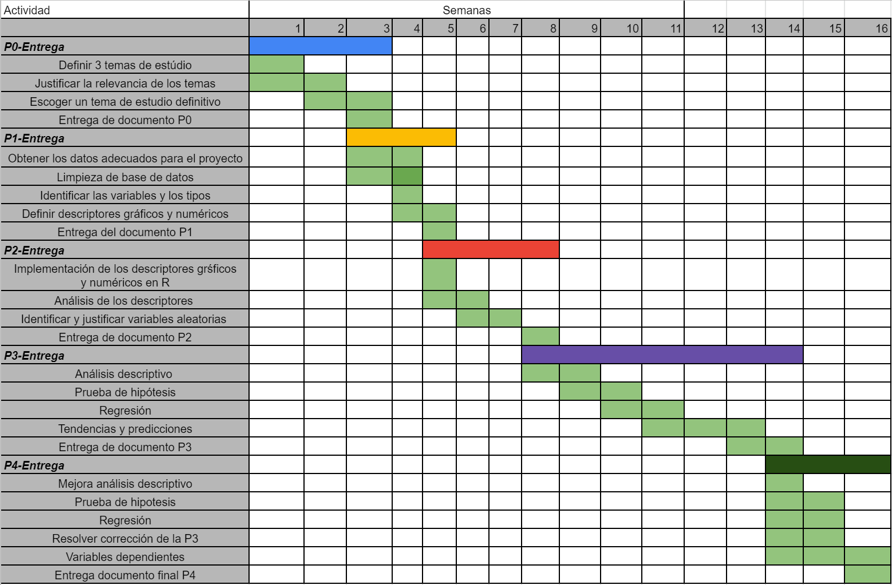

Impacto del proceso de vacunación contra el Covid-19
========================================================
author:
date: 21-05-2021
autosize: true

Importancia
=========================================================
El estudio busca sensibilizar e informar a la población sobre los efectos generados por el proceso de vacunación contra la Covid-19 en las regiones del Perú, por lo que se considera un tema de interés público debido al contexto actual.

Obtención de los datos
========================================================
Plataforma Nacional de Datos Abiertos
- [Datos sobre vacunados](https://www.datosabiertos.gob.pe/dataset/vacunaci%C3%B3n-contra-covid-19-ministerio-de-salud-minsa-0): 
  - Datos faltantes:  127931
  - Observaciones completas: 2671786
  - Porcentaje de observaciones incompletas: 4.57
- [Datos sobre fallecidos](https://www.datosabiertos.gob.pe/dataset/fallecidos-por-covid-19-ministerio-de-salud-minsa/resource/4b7636f3-5f0c-4404-8526):
  - Datos faltantes: 0
  - Observaciones completas: 66770
  
  
Clasificación de las variables del estudio
========================================================
Datos sobre fallecidos por Covid-19

Variable | Tipo de variable | Restricciones
------------- | ------------- | -------------
EDAD | Numérica Discreta | Entero Positivo 
SEXO | Categórica Nominal | Masculino, Femenino
DEPARTAMENTO | Categórica Nominal | Departamentos del Perú
FECHA_FALLECIDO | | 

Clasificación de las variables del estudio
========================================================
Datos sobre proceso de vacunación de covid-19

Variable | Tipo de variable | Restricciones
------------- | ------------- | -------------
GRUPO_RIESGO | C. Nominal | Grupos de riesgo incluidos para el proceso de vacunacion(PNP)   
EDAD | N. Discreta | Entero mayor a 17
SEXO | C. Nominal | Masculino, Femenino
FECHA_VACUNACION | |
DOSIS | C. Nominal | 1,2
Fabricante | C. Nominal | SINOPHARM, PFIZER, ASTRAZENECA
DEPARTAMENTO | C. Nominal | Departamentos del Perú

Objetivos 
=========================================================
Analizar la cantidad de fallecidos en el periodo de la segunda ola.

- Variables: 
  - Fallecidos &rarr; **FECHA_FALLECIMIENTO**
- Descriptores gráficos:
  - Histograma
  - Seleccion de escala: Número mínimo de fallecidos por grupo poblacional hasta número máximo de fallecidos por grupo.

Objetivos 
=========================================================
Analizar la cantidad de fallecidos en el periodo de la segunda ola.

<figcaption> Grafico de referencia </figcaption>

Objetivos 
=========================================================
Hallar la comparación del impacto de la vacunación en los diferentes departamentos del país.

- Variables: 
  - Fallecidos &rarr; Departamento , **FECHA_FALLECIMIENTO**
  - Table &rarr; Departamento, **FECHA_VACUNACION**
- Descriptores gráficos:
  - Polígono de frecuencias
  - Selección de escala

Objetivos 
=========================================================
Visualizar la curva de fallecidos desde el inicio de la vacunación según la etapa de vida

- Variables: 
  - Fallecidos &rarr; **EDAD**
  - Table &rarr; **FECHA_VACUNACION**
- Descriptores gráficos:
  - Polígono de frecuencias, para cada etapa de vida

Objetivos 
=========================================================
Visualizar la curva de fallecidos desde el inicio de la vacunación según la etapa de vida

<figcaption> Grafico de referencia </figcaption>

Objetivos 
=========================================================
Determinar si es que existe relación entre las distintas vacunas con la cantidad de fallecidos en los distintos departamentos

- Variables: 
  - Vacunación &rarr; **FECHA_VACUNACION**, **FABRICANTE**, **DEPARTAMENTO**
  - Fallecidos &rarr; **FECHA_FALLECIMIENTO**, **DEPARTAMENTO** 
- Descriptores númericos: Correlación
- Descriptores gráficos:
  - Polígono de frecuencias de cantidad de fallecidos por región desde el inicio del proceso de vacunación.
  - Tabla de frecuencias de las vacunas más aplicadas por departamento en proporción con la cantidad de vacunados.

Factibilidad
========================================================

 

<figcaption> Diagrama de Gantt </figcaption>

¡Gracias!
=======================================================
¿Preguntas?

